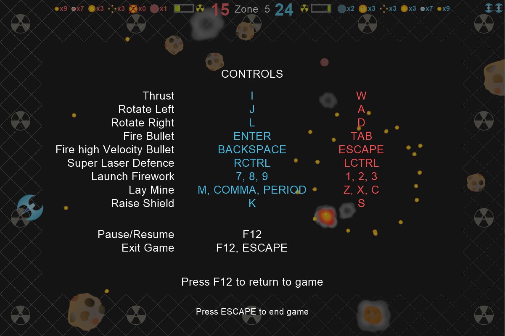

# pyroids

Asteroids game with features including:
* 1 or 2 player
* Multiple weapons
* Expendable ammunition
* Supply drops
* Radiation exposure
* Highly customisable - you make the game!

## Installation

The simplest way to install pyroids is directly from PyPI:

	$ pip install --upgrade pyroids --user

#### Alternatively

Install from the source distribution on github:

	$ pip install git+https//github.com/maread99/pyroids.git#egg=pyroids

Install from a source distribution stored locally:

	$ python setup.py install --user

## Requirements

pyroids requires Python 3.6+ (employs annotation syntax).

The only dependency is pyglet 1.4 which, if not already installed, will be installed as part of the pyroids installation process.

## Play me!

Once installed, pyroids can be launched directly from the command line or via the launch() function.

#### From the command line:

    $ python -m pyroids.play

To launch with settings as defined by a configuration file (see [Game Customisation](#game-customisation) section), for example 'expert.py':

    $ python -m pyroids.play expert

If pyroids was installed via pip then the application \*might also launch with default settings with a simple:

	$ pyroids

\* requires that the *Scripts* directory, of the python environment to which pyroids was installed, is included to the PATH environmental variable.

#### Using launch function:

    >>> import pyroids
    >>> pyroids.launch()

To launch with settings as defined by a configuration file (see [Game Customisation](#game-customisation) section), for example 'novice.py':

    >>> pyroids.launch('novice')

## Game Customisation

Settings that can be defined for each level include:
* Number of Asteroids
* Number of times each original asteroid will break up into smaller asteroids
* Number of smaller asteroids each asteroid breaks up into
* Asteroid speed
* Ship Speed
* Radiation field
* Radiation exposure limits
* Number of supply drops

Settings that can be defined for the duration of an application instance include:
* Ship Controls	
* Asteroid behaviour on reaching window border	
* Initial ammunition stocks per weapon
* Frequency and number of supply drops
* Min and Max ammunition stocks in each supply drop (per weapon)
* Cannon reload rate
* High Velocity Bullet speed
* Shield duration
* Number of Levels
* Number of Lives
* Window dimensions

Settings can be customised by creating a configuration file and passing the configuration file's name when the application is run (see [Play me!](#play-me) section). If no configuration file is passed then the game will use default settings. See [pyroids\config\template.py](pyroids/config/template.py) documentation for instructions to set up configuration files.

The following example configuration files are included as part of the pyroids'
distribution:
* [novice.py](pyroids/config/novice.py)
* [expert.py](pyroids/config/expert.py)

Aside from the configuration files, the ship and asteroid images can be changed with a little investigation of the source code and some minimal hacks.

## Not feeling the love

	$ pip uninstall pyroids

## Licensing

#### Code
See [LICENSE.txt](LICENSE.txt).

#### Media
See [pyroids\resources\README.md](pyroids/resources/README.md).

## Code Documentation

Function and method documentation:
* does not by default list all optional and keyword arguments, for which signatures should be inspected.
* does not state argument types or return values, for which signatures' annotation should be inspected.

Names referenced in documentation are surrounded by symbols that identify the nature of the assigned object:

Name | Nature of assigned object
---- | -------------------------
+parameter_name+ | Parameter of documented function or method.
++parameter_name++ | Parameter of class constructor method.
-variable_name- | Variable local to code being documented.
--attribute_name-- | Instance attribute.
--method_name(args, kwargs)-- | Instance method. Only args / kwargs referred to in the 		subseqeunt documentation are noted. Signature should be inspected for full parameters.
---classmethod_name()--- | Class method or static method.
----global_constant_name---- | Global constant.

## Issues

Please use the project's [issue page](issues) to report any issues.

## Contact

[Marcus Read](mailto:marcusaread@gmail.com)